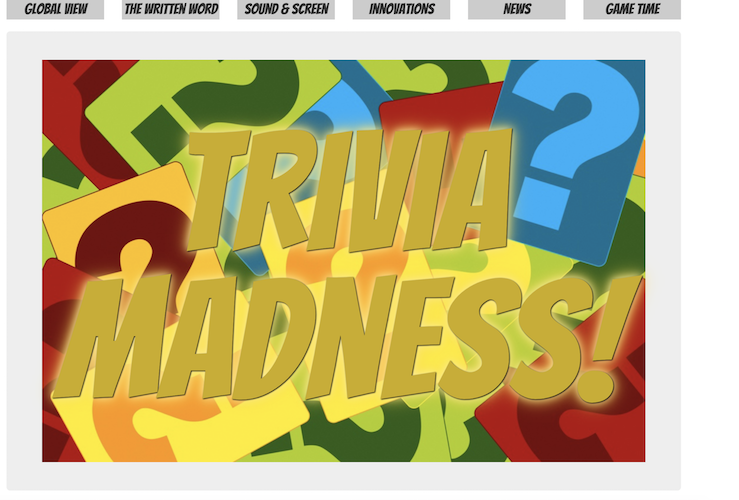
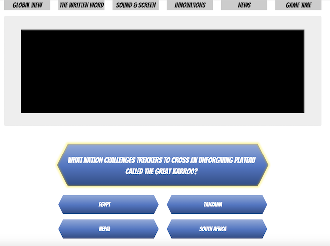

# TriviaGame





## What Is It?
A Bootstrap themed Trivia Game using Javascript

## How Do I Play?
There are two ways you can get in on the Trivia Madness:
1. The game is hosted on GitHub Pages, you can access it [HERE](https://xtiane.github.io/TriviaGame/)
2. Clone this repository and then launch ```index.html``` from your browser

## Under The Hood
The games was created using Bootstrap and JavaScript.  All of the game logic is located in ```assets/javascript/app.js```.  Questions are randomly chosen from objects based on the category chosen.
